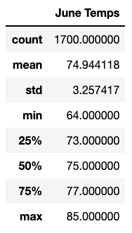
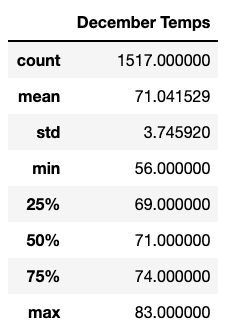

# surfs_up

## Overview of Analysis
The purpose of this assignment is to create a statistical analysis of temperatures in Oahu for the months of June and december. The goal is to see if these months are favorable for the surf and ice cream shop business to stay in business year round. We will create a query that will capture previous data for the months of June and December's temperatures. 

## Results
### June Temperature Results

Based on our findings for the month of June, we know that we have 1,700 observations for previous June months. This data covers. years between 2010 and 2017. We can see below the average, minimum, and maximum temperatures. 

### December Temperature Results

Based on our findings for the month of Decemer, we have 1,517 observations for previous December months. These results are for the same years as June but there are close to 200 missing dates. We can see below the average, minimum, and maximum temperatures. What we can see from both of these results are that they are relatively close in temperatures.

## Summary:
When comparing the months of June and December, what we found is that the temperature is failry similar all year long. What would be interesting to research is storm data. Temperature has somewhat of an effect on the surf and ice cream shop's business, but storms would definitely deter patrons from visiting the store. Also, knowing that Hawaii is a highly tourist driven economy, identifying peaks in tourism for the island could be beneficial to this study.
